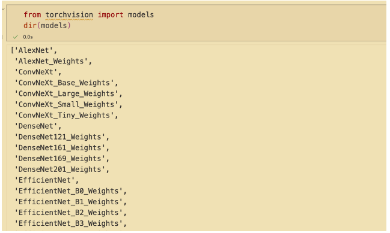
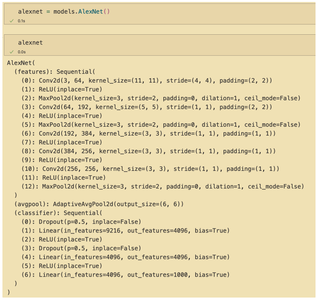
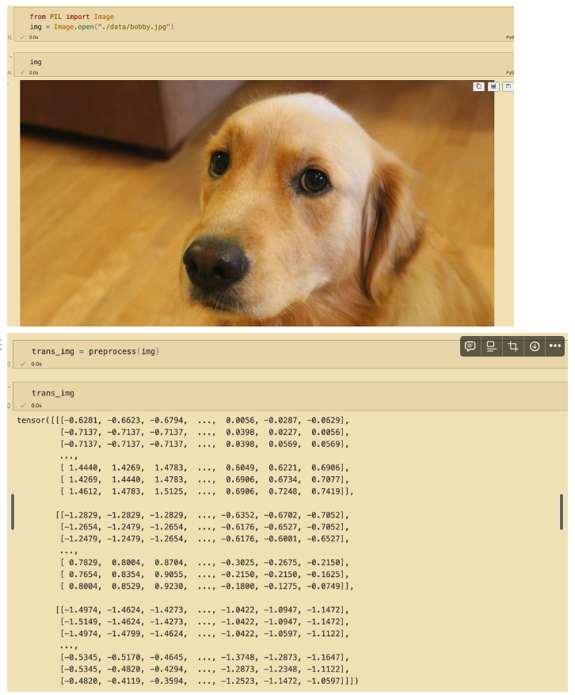
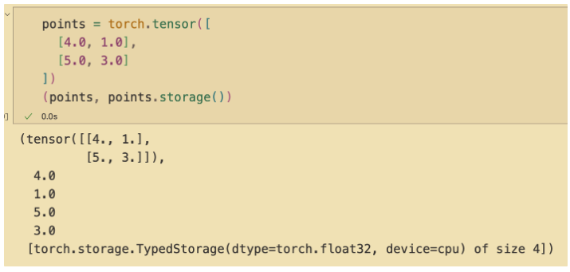
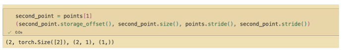

# 1장. 딥러닝과 파이토치 라이브러리 소개

별 내용 없음. 파이토치가 좋음 정도.

텐서 쓴다. gpu필요하다. 그런 얘기 정도

다른 언어로도 가능하다.

요약

- 딥러닝 모델은 샘플을 학습해서 주어진 입력에 대해 기대 결과를 출력하는 방법을 자동으로 배운다.
- 파이토치 등의 라이브러리를 통해 효과적으로 신경망 모델ㅇ르 만들고 훈련시킬 수 있다.
- 파이토치는 유연함과 속도에 집중하며 알아보기 쉬움. 또한 연산을 위해 즉시 실행을 기본으로 지원
- 토치스크립트를 활용하면 모델을 미리 컴파일 해, 파이썬, cpp, 모바일 기기에서도 모델을 동작시킬 수 있음

# 2장. 사전 훈련된 신경망

**다루는 내용**

- 사전 훈련된 이미지 인식 모델 돌려보기
- GAN & CycleGAN 소개
- 이미지에서 텍스트 설명을 만들어낼 수 있는 자막 모델
- 토치 허브에 모델 공유

### 2.1 이미지 인식 사전 훈련 신경망

torchvision에 사전 훈련된 모델들이 존재


아래와 같이 객체를 불러온것을 볼 수 있음. 단 이 경우에는 가중치는 없이 모델 구조만 불러



아래와 같이 가중치 값을 포함해서 불러올 수 있음. 

각 줄마다 modules를 사용하고 있으며, 신경망 구성 블럭(layer) 등으로 불리는 부분

```python
resnet = models.resnet101(pretrained = True)

---

ResNet(
  (conv1): Conv2d(3, 64, kernel_size=(7, 7), stride=(2, 2), padding=(3, 3), bias=False)
  (bn1): BatchNorm2d(64, eps=1e-05, momentum=0.1, affine=True, track_running_stats=True)
  (relu): ReLU(inplace=True)
  (maxpool): MaxPool2d(kernel_size=3, stride=2, padding=1, dilation=1, ceil_mode=False)
  (layer1): Sequential(
    (0): Bottleneck(
      (conv1): Conv2d(64, 64, kernel_size=(1, 1), stride=(1, 1), bias=False)
      (bn1): BatchNorm2d(64, eps=1e-05, momentum=0.1, affine=True, track_running_stats=True)
      (conv2): Conv2d(64, 64, kernel_size=(3, 3), stride=(1, 1), padding=(1, 1), bias=False)
      (bn2): BatchNorm2d(64, eps=1e-05, momentum=0.1, affine=True, track_running_stats=True)
      (conv3): Conv2d(64, 256, kernel_size=(1, 1), stride=(1, 1), bias=False)
...
    (2): Bottleneck(
      (conv1): Conv2d(2048, 512, kernel_size=(1, 1), stride=(1, 1), bias=False)
      (bn1): BatchNorm2d(512, eps=1e-05, momentum=0.1, affine=True, track_running_stats=True)
      (conv2): Conv2d(512, 512, kernel_size=(3, 3), stride=(1, 1), padding=(1, 1), bias=False)
      (bn2): BatchNorm2d(512, eps=1e-05, momentum=0.1, affine=True, track_running_stats=True)
      (conv3): Conv2d(512, 2048, kernel_size=(1, 1), stride=(1, 1), bias=False)
      (bn3): BatchNorm2d(2048, eps=1e-05, momentum=0.1, affine=True, track_running_stats=True)
      (relu): ReLU(inplace=True)
    )
  )
  (avgpool): AdaptiveAvgPool2d(output_size=(1, 1))
  (fc): Linear(in_features=2048, out_features=1000, bias=True)
)
```

**중요 : 아래와 같이 이미지 전처리를 하나의 파이프라인으로 만들 수 있음**

```python
from torchvision import transforms
preprocess = transforms.Compose([
  transforms.Resize(256), # 입력 이미지 크기 256 x 256으로 조정
  transforms.CenterCrop(224), # 중심으로 부터 224 x 224 wkffksoa
  transforms.ToTensor(), # img to tensor
  transforms.Normalize(
    mean = [0.485, 0.456, 0.406],
    std = [0.229, 0.224, 0.224]
  ) # normalize r,g,b channel with mean and standard deviation
])
```



```python
import torch
batch_t = torch.unsqueeze(trans_img, 0)

print(trans_img.shape, batch_t.shape)

>> torch.Size([3, 224, 224]) torch.Size([1, 3, 224, 224])
```

eval mode → 배치 정규화, 드롭아웃과 같은 훈련에 필요한 기술 베재

```python
out = resnet(batch_t) # (1, 1000) : predict result of 1000 label(score) of 1 data

with open('./data/imagenet_classes.txt') as f:
  labels = [line.strip() for line in f.readlines()]

_, index = torch.max(out, 1)
'''
torch.return_types.max(
values=tensor([15.6785], grad_fn=<MaxBackward0>),
indices=tensor([207]))
'''

percentage = torch.nn.functional.softmax(out, dim=1)[0] * 100
labels[index[0]], percentage[index[0]].item()
'''
('golden retriever', 96.29560852050781)
'''
_, indices = torch.sort(out, descending=True)
[(labels[idx], percentage[idx].item()) for idx in indices[0][:5]]
"""
[('golden retriever', 96.29560852050781),
 ('Labrador retriever', 2.791818380355835),
 ('cocker spaniel, English cocker spaniel, cocker', 0.2930065989494324),
 ('redbone', 0.20991282165050507),
 ('tennis ball', 0.11677949130535126)]
"""
```

### 2.2 가짜 이미지를 만드는 사전 훈련된 모델

- GAN : Generative Adversarial Network(생성적 적대 모델)
    - 사담) 생성자와 판별자(식별자) 둘이 경쟁하는 신경망임.
- CycleGAN :
    - (사담) 아래 내용은 원 논문 리뷰를 참고한 내용
    - 생성자1 : G: X→Y(말 → 얼룩말)
    - 생성자2: F: Y→X(얼룩말→말)
    - 판별자 : D_x, D_y
- 모델 만들기는 일단 미뤄두고, 만든 모델 구조와 학습된 파라미터를 사용해서 모델을 사용해보자.
    - 모델의 텐서 파라미터는 .pth 포맷(pickle 포맷)으로 저장되고, 이를 torch.load()로 텐서 형태로 바꿀 수 있으며, model.load_state_dict()을 통해 가중치를 모델에 넣어 줄 수 있다.
        
        ```python
        path = './some_weight.pth' # file path
        tensor = torch.load(path) # pickle object to tensor
        model.load_state_dict(tensor) # tensor as a model weight
        ```
        

### 2.3 장면을 설명하는 사전 훈련된 신경망

- 컨볼루션으로 이미지 인식 → 순환 신경망(RNN)으로 텍스트 생성

### 2.4 TorchHub

- 제작자가 깃허브에 모델 공개, 사전 훈련 가중치 포함 여부 선택 가능
- 파이토치가 이해하는 인터페이스(hubconf.py)로 노출하는 형태
- 사담) 책 내용도 좋아보이지만, 아래의 공식 문서를 읽어보는게 좋을 듯
- [https://pytorch.org/docs/stable/hub.html](https://pytorch.org/docs/stable/hub.html)

### 2.7 핵심 요약

- 사전 훈련된 모델은 데이터셋으로 이미 훈련된 모델을 지칭, 신경망 파라마티러를 로딩해 즉시 의미있는 결과를 만들어낸다.
- 사전 훈련된 모델을 사용하면, 모델 설계나 훈련할 필요 없이 바로 신경망을 프로젝트에 활용할 수 있음 → 사담 ; 프로토타입 만들 때 상당히 유용해보임
- AlexNet, ResNet은 발표된 첫 해, 이미지 인식 대회에서 최고 점수를 경신한 DCNN
- GAN : 생성자 + 식별자, 실제와 구분하기 어려운 이미지를 만들어냄
- CycleGAN : 두 개의 다른 클래스 이미지 간 서로 변환하는 역할을 함.
- NeuralTalk2 :  이미지를 입력으로 받고 내용을 설명하는 텍스트를 출력하는 하이브리드 모델 아키텍쳐를 가짐
- 토치 허브는 적절한 hubconf.py파일을 포함한 프로젝트에서 모델과 가중치를 로드하기 위한 표준화된 방식 제공 → 사담 : 요즘은 허깅페이스도 많이 쓰이는 듯함.

# 3장. 텐서 구조체

## 3.1 부동소수점 수의 세계

- 실세계 데이터 → 부동소수점 수로 인코딩 하고 모델 처리 후 나온 결과값은 해석 가능하게 디코딩 해야함.
- 심층 신경망 : 여러 단계를 걸친 데이터 변환.
    - 단계 간 변환 데이터들은 중간 단계의 표현으로 해석할 수 있음
- 파이토치는 입력, 중간표현, 출력으로 데이터를 어떻게 다루고 저장하는가?
    - Tensor 자료구조 : 다차원 배열(multidimensional array)

## 3.2 텐서 : 다차원 배열

### 3.2.1 파이썬 리스트에서 파이토치 텐서로

### 3.2.2 첫 텐서 만들어 보기

```python
import torch

a = torch.ones(3) # size 3, 1 dim tensor with value 1
print(a)
```

### 3.2.3 텐서의 핵심

- 파이썬 리스트, 튜플 객체는 메모리에 떨어진 공간에 따로 할당
- 파이토치 텐서, 넘파이 배열은 파이썬 객체가 아닌, unboxing 된 c언어의 숫자 타입(ex. int, float)을 포함한 **연속적인 메모리**가 할당되고, 이에 대한 뷰(view)를 제공.
    - 각 요소는 32bit(4byte) float 타입으로 100만개의 float타입 숫자를 1차원 텐서에 보관하면, 400만 바이트의 연속적인 공간과 약간의 메타데이터 공간을 차지
    
    ```python
    # 1.
    points = torch.zeros(3,2)
    points
    '''
    tensor([[0., 0.],
            [0., 0.],
            [0., 0.]])
    '''
    # 2.
    points = torch.tensor([
      [4.0, 1.0],
      [5.0, 3.0],
      [2.0, 1.0]
    ])
    points
    '''
    tensor([[4., 1.],
            [5., 3.],
            [2., 1.]])
    '''
    # 3.
    points[0]
    '''
    tensor([4., 1.])
    '''
    ```
    
    - 위의 코드에서 2와 3을 살펴보면 재미있는 부분이 있는데, 인덱싱을 해서 읽은 결과도 텐서이다.
    그렇다면 그 때마다 새로운 메모리에 값들을 복사해서 새 객체를 래핑해 반환하는가?
    - → 매우 비효율적. 3.7절에서 다시 살펴보자.

## 3.3 텐서 인덱싱

- 파이썬, 넘파이 인덱싱 과 동일함.

## 3.4 이름이 있는 텐서

- 텐서에는 차원, 축이 존재하며, 각 차원은 이미지의 경우에는 픽셀 위치, 컬러 채널 등에 해당. 때문에 텐서에 접근하기 위해서는 차원의 순서를 기억해서 인덱싱 해야함. 데이터가 여러 형태를 거치며 다양하게 변환되면, 어느 차원에 어떤 데이터가 있는지 실수하기 쉬움
    
    ```python
    weights_named = torch.tensor([0.1, 0.3, 0.2], 
                                 names = ['channels']) # naming when construct tensor
    print(weights_named)
    
    # naming after construct tensor
    image_t = torch.randn(3, 5, 5) # 채녈 크기, 행 크기, 열 크기
    batch_t = torch.randn(2, 3, 5, 5) # 배치 크기, 채널 크기, 행 크기, 열 크기
    
    img_named = image_t.refine_names(..., 'channels', 'rows', 'columns')
    batch_named = batch_t.refine_names('batch_size','channels', 'rows', 'columns')
    
    print(f'{img_named.shape, img_named.names}\n{batch_named.shape, batch_named.names}')
    
    # 텐서 간 연산, 차원의 크기가 같거나, 브로드캐스팅이 가능한지? 이름이 지정되어 있으면,
    # 파이토치가 알아서 체크 해줌. 그러나 차원을 자동으로 정렬해주지 않기 때문에 아래와 같이
    #  align_as와 같은 작업이 필요함
    weights_aligned = weights_named.align_as(img_named)
    print(weights_aligned.shape, weights_aligned.names)
    
    # 차원 인수를 허용하는 함수들은 이름이 붙은 차원도 받아들인다.
    gray_named = (img_named * weights_aligned).sum('channels')
    print(gray_named.shape, gray_named.names)
    
    ```
    
- 사담) pytorch 2.2. 기준으로 아직 프로토타입 특성임.

## 3.5 텐서 요소 타입

- 파이썬 숫자 타입은 비효율적
    - 파이썬에서 숫자는 객체임 : 즉 32비트 공간 + 기타 데이터를 합쳐 하나의 파이썬 객체로 만든다.
    - 파이썬에서 리스트는 연속된 객체의 컬렉션. 즉 연산이 없음.
    - 파이썬 인터프리터는 최적화를 걸치는 컴파일된 코드 보다 느림
- 따라서 넘파이 또는 파이토치 텐서와 같은 전용 데이터 구조를 만들고 숫자 데이터 연산은 저수준 언어로 효율을 높이고, 고차원 api로 이러한 구현을 래핑해 편리성을 더함

### 3.5.1 dtype으로 숫자 타입 지정

- torch.float32, torch.int8, torch.uint8, torch.bool …

### 3.5.2 모든 경우에 사용하는 dtype

- 대부분 32비트 부동소수점 연산(torch.float32)
- float64 : 개선은 별로 없고, 메모리와 시간만 낭비
- float16 : 정확도를 희생해 공간을 줄일 수 있음(양자화)
- 텐서를 다른 텐서에 대한 인덱스로 사용가능. 이 때 인덱스로 사용된 텐서를 int64로 간주.

### 3.5.3 텐서의 dtype 속성 관리

- 생성자에 dtype인자 전잘
- tensor.to(torch.int64)와 같이 캐스팅 가능
- 여러 타입의 입력이 섞이면, 가장 큰 타입으로 결정

## 3.6 텐서 API

- 텐서 간 연산의 대부분은 torch 모듈에 있으며, 탠서 객체에 대해 메소드처럼 호출할 수도 있음
    
    ```python
    a = torch.ones(3,2)
    a_t = torch.transpose(a, 0, 1)
    print(a_t.shape)
    a_t = a.transpose(0,1)
    print(a_t.shape)
    ```
    
- 자세한 것은 공식 문서를 참고한다.

## 3.7 텐서를 저장소 관점에서 머리속에 그려보기

- 텐서의 값 자체는 `torch.Storage` 인스턴스로 관리하며 연속적인 메모리로 할당된 상태
    - 숫자 데이터를 가진 1차원 배열
- Tensor 객체는 이러한 저장 공간에 대한 뷰 역할을 담당하고, 오프셋을 사용해서 공간의 임의 위치에 접근하거나 특정 차원의 크기를 단위로 해서 접근할 수 있다.
- 아래의 코드를 보고 비교해보자.



### 3.7.2 저장된 값 수정

- _ 로 끝나는 연산들은 새 텐서가 넘어오는 대신 기존 텐서의 내용이 바뀐다.

## 3.8 텐서 메타데이터 : 사이즈, 오프셋, 스트라이드

- 사이즈(넘파이의 shape) : 각 차원 별 들어가는 요소의 수
- offset : 텐서의 첫 번째 요소를 가리키는 색인 값
- stride : 각 차원에서 다음 요소를 가리키고 싶을 때 얼마나 건너 뛰어야 하는지?
- 사담) c언어의 배열 구현과 비슷하다.

### 3.8.1 다른 텐서의 저장 공간에 대한 뷰 만들기

- 2차원 데이터의 경우 접근 방법 : offset + stride[0] * i + stride[1] * j    
  
- 이러한 방식으로 인해 전치나 일부 만으로 더 작은 텐서를 만들 때, 적은 비용으로 연산을 수행할 수 있다.
- 같은 저장 공간을 가리키기 때문에 작은 텐서를 수정해도 큰 텐서가 변한다.
- 따라서 tensor.clone()과 같은 방식으로 문제를 방지할 수 있다.

## 3.9 텐서를 GPU 로 옮기기

- 사담) 옮기는 법 자체는 검색하면서 따라해보는 게 빠르다. 생략한다.
- 단, 옮기면, 시스템의 램에 저장되는 것이 아닌 GPU의 램에 저장된다는 사실에 유의하자.
- 연산 결과가 cpu로 옮겨지지도 않는다. 다만 핸들을 반환할 뿐이다.
- 필요하다면 다시  cpu로 옮겨주어야한다.

## 3.10 넘파이 호환

- tensor.numpy() → 텐서를 넘파이 배열로
- torch.from_numpy(np.array) → 넘파이 배열을 텐서로.
- 재미있는 점은 파이썬 버퍼 프로토콜이라는 저장 시스템을 공유하기 때문에, 별도의 재할당 없이 기존 버퍼에 저장되어 있는 값을 래핑만 한다.

## 3.11 일반화된 텐서도 텐서다.

- 사담) 여기는 대략은 알겠는데 감만 잡히고 잘 모르겠음
- 실제 내부 구현과 3.6절의 텐서 api는 분리되어 있기 때문에 api만 만족하면 실제 구현 상세는 몰라도 텐서로 간주할 수 있다.
- ex. TPU 특화 텐서, 희소 텐서, 양자화된 텐서 등.

## 3.12 텐서 직렬화

- 사담) 직렬화 : (극히 단순화 하면..) 텐서 값 저장
- 내부적으로 pickle 사용
- torch.load(), torch.save()가 주요 함수.
- 단, 파일 포맷이 비호환되기 때문에,  파이토치가 아닌 다른 소프트웨어로는 읽을 수 없음

### 3.12.1 h5py로 HDF5 병렬화하기

- 호환성이 필요한 경우에 선택할 수 있는 방법
- 다만 새 프로젝트에서는 이럴 필요가 거의 없음.
- 이식성이 높고, 광범위 하게 지원되는 중첩된 키-값 딕셔너리에서 직렬화된 정형 다차원 배열을 표현하는 배열

```python
conda install h5py
```

- 사담) 지금 볼 필요는 없을 것 같고, 필요해지면 다시 돌아와보자.

## 3.15 핵심 요약

- 신경망은 부동소수점 표현의 변환
- 부동 소수점 표현은 텐서에 저장됨
- 텐서는 다차원 배열이며 파이토치의 기본 자료구조이다
- 파이토치는 텐서의 생성이나 조작 그리고 수학 연산 같은 다양한 표준 라이브러리를 제공함
- 텐서는 병렬화해 디스크에 저장하거나, 불러올 수 있음
- 텐서 연산은 코드 변경없이 기기를 오갈 수 있음
- 바꿔치기 연산은 _(언더바)로 끝남.