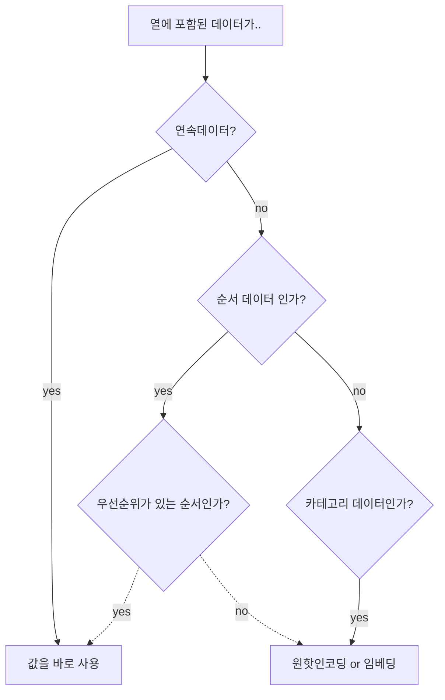

# 4장. 실제 데이터를 텐서로 표현해보기

How? Text, Video, Image → Tensor

## 4.1. 이미지 다루기

픽셀 단위의 높이 너비 * 여러 개의 스칼라 값 모음

### 4.1.1. 컬러 채널 더하기

RGB 각 색 별 강도.

### 4.1.2. 이미지 파일 로딩

imageio? → Pytorch 모듈의 입력 : Channel * Height * Width

(사담)공식문서를 보는 것이 필요하겠습니다.

### 4.1.3. 레이아웃 변경

간혹 이미지 처리 라이브러리의 결과물의 축이 원하는 형태가 아닐 때가 있음. 예를 들자면 CHW이 아니라, HWC라든지.. 그런 경우에는 축을 수정해줘야함.

```python
# 2번째 축이 처음으로, 
# 0번째 축이 두번째로,
# 1번째 축이 세번째로 간다.
Tensor.permute(2,0,1)
```

### 4.1.4. 데이터 정규화

## 4.2. 3차원 이미지 : 용적 데이터

ex. MRI

$$
N\times C\times D\times H\times W
$$

N: batch_size

C: channel(color, alpha ..)

D: Depth

H: Height

W: Width

결국에는 3차원 이미지의 축은 4개라는 거

```python
torch.unsqueeze(tensor_name, axis) # 원하는 축에 차원을 만든다.
```

## 4.3. 테이블 데이터 표현하기.

ex. 스프레드 시트,  csv, DB …

independent한 샘플(행)의 집합이라 생각하자.

각 열의 자료형은 다르다. (ex.  온도는 실수, 색은 문자열 등)

### 4.3.2. 와인 데이터를 텐서로 읽어오기.

**csv 파일 읽는 법**

- python 내장 csv 모듈 활용
- Numpy
- Pandas: 일반적으로 가장 빠르고 메모리 효율적.

숫자값의 세 종류

- 연속값
- 순서값
- 카테고리값 : 임의의 숫자를 품목 당 매김.

### 4.3.4. 원핫 인코딩

일반적으로 카테고리값에 적절함. 순서값에는 부적절.

원핫인코딩을 하고 싶다면 scatter_()함수를 활용하자. 자세한건 필요할 때 공식문서를 본다.

### 4.3.5. 언제 카테고리화 할 것인가?



### 4.3.6. 임계값으로 찾기

advanced indexing : bool리스트로 인덱싱을 할 수 있다!

## 4.4. 시계열 데이터 다루기

$$
N \times C\times L
$$

N: 샘플 수 

C: 채널 (input feature #)

L: Sequence Length

## 4.5. 텍스트 표현하기.

- 임베딩..
- 원핫인코딩..
- character단위
- word단위
- 등..

# 5장. 학습기법

다루는 내용

- 데이터로부터 알고리즘이 학습하는 방법
- 미분과 경사 하강법을 사용한 파라미터 추정이라는 관점으로 학습에 대한 재구성
- 간단한 학습 알고리즘 훑어보기
- 학습을 돕는 파이토치의 자동미분

## 5.1. 시대를 초월하는 모델링 학습

케플러 법칙을 예로 든다. 케플러의 업적은 다음과 같음

1. 동료로부터 좋은 데이터를 많이 얻음
2. 수상한 부분을 가시화하고자 함
3. 데이터에 가장 잘 부합하는 최대한 단순한 모델을 고름
4. 데이터를 쪼개 일부만 사용하고 나머지는 검증을 위해 남겨둠
5. 모델이 관찰 결과와 맞을 때까지 반복
6. 별도의 관찰을 통해 자신의 모델 검증
7. 의심스러운 부분 검토

일반화된 함수(딥러닝 모델)을 자동으로 적합(fitting)하는 법을 배워본다.

## 5.2. 학습은 파라미터 추정에 불과

실제 자료와 가중치 값이 주어지면, 모델에 입력 데이터가 들어가 예측값이 나오며(순방향 전파), 실제값과 예측값을 비교해 오차를 계산한다. 파라미터 최적화를 위해 가중치를 오차값에 따라 일정 단위만큼 변경. 이러한 변경(그라디언드)은 합성 함수의 미분을 연쇄 법칙(chain rule)을 이용해 계산한다.(역방향 전파)

### 5.2.1 온도 문제

온도 문제를 통해 상기한 과정을 이해해본다. 

어느 정도 배경지식이 있다 가정하고 예시 없이 필요한 부분만 정리한다. 

최적화 과정 : 손실함수의 값이 최소인 지점에서 파라미터를 찾는 과정

손실함수(loss function, cost function): 오차가 높으면 함수의 출력값도 높아지고, 오차가 작아지면 함수의 출력값도 작게 한다.

- MSE(Mean Squared Error)
- MAE(Mean Absolute Error)

/Untitled.png)

제곱손실이 절댓값손실보다 잘못된 결과에 더 많은 불이익을 준다는 사실을 알 수 있다. →(사담) 위 문장의 의미를 생각해보자면, 절댓값손실은 모든 오차에 대해 기울기의 절대값이 동일하지만, 제곱손실은 오차가 커질수록 기울기의 절댓값이 커진다는 의미가 되겠다.

## 5.4. 경사를 따라 내려가기

경사하강법..  알죠?

### 5.4.3. 모델 적합을 위한 반복.

용어 정리

- Epoch: 훈련 샘플을 가지고 반복적으로 파라미터를 조정하는 훈련의 한 단위(사담] 일반적으로 훈련셋을 한번 다 사용하는걸 한 에포크라 합니다)

### 5.4.4. 입력 정규화

사담] 재미있는 내용이라 정리

입력 특성 각각의 범위(scale)이 다르면 기울기의 크기 역시 달라짐. 하나의 파라미터에 최적화된 학습률은 다른 파라미터에서는 부적절할 수 있음. 이를 해결하려면 파라미터 별 다른 학습률을 주어야하나, 쉽지 않음. ⇒ 그럼 입력 특성 값의 범위를 통일하면 되겠네! = 정규화

## 5.5. 파이토치의 자동미분 : 모든 것을 역전파하라.

직접 연쇄 법칙 계산하고 해석해 구하고.. 이걸 누가하냐??

### 5.5.1 기울기 자동계산

파이토치 텐서는(사실 대부분의 딥러닝 라이브러리의 텐서는..)자신이 어디로부터 왔는지를 저장함. 즉, 어느 텐서에서 어떤 연산을 수행해서 만들어진 텐서인지 기억하고 있으며, 때문에 자연스럽게 미분을 최초 입력까지 연쇄적으로 적용해 올라갈 수 있음. 따라서 모델에서 미분을 수동으로 도출할 필요가 없음.([사담]밑바닥부터 시작하는 딥러닝3에 자세하게 설명되어 있음)

- 미분 속성 사용
    - 텐서의 require_grad = True
    - loss.backward()
- 미분 함수 누적
    - 중요! 파이토치는 연쇄적으로 연결된 함수를 거쳐 손실에 대한 미분을 계산하고 값을 텐서의 grad 속성에 **누적**한다.
    - 따라서 다음과 같이 명시적으로 기울기를 0으로 초기화해야 함.
        
        ```python
        if params.grad is not None:
        	params.grad.zero_()
        
        # [사담] 책에서는 직접 optimizer를 만들어 위와 같이 했지만,
        # 실제로는 다음과 같이 사용함(5.5.2에서 소개하네, 머쓱)
        # optimizer 정의
        optimizer = optim.Adam(model.parameters(), lr=1e-4)
        # 훈련 루프 내에서
        optimizer.zero_grad()
        loss.backward()
        optimizer.step()
        ```
        

### 5.5.3 훈련, 검증, 과적합

- 과적합(overfitting) : 훈련셋이 아닌 다른 데이터를 사용했을 때, 기대보다 높은 손실값을 얻은 경우

과적합을 방지하기 위해서는 training set/validation set으로 나눈다. 

방지하기 위한 몇가지 방안들

- Penalization term
- Add the Noise to input data
- Simplify the model.

### 5.5.4. 자동미분의 주의사항과 자동미분 끄기

우선 지정한 손실에 대해서만 역전파를 하기 때문에 훈련손실과 검증손실은 별개라고 생각해도 됨.

그러나, 검증손실을 계산할 때, 계산 그래프를 만드는데, 이는 비효율적일 수 있음(특히, 모델이 크다면..)

`torch.no_gred()` 콘텍스트 관리자를 이용해 자동 미분 기능을 끌 수 있음

```python
with torch.no_grad(): # 이 줄을 torch.set_grad_enabled(is_train:Bool)로 변경할 수 있음
	val_pred = model(val..)
	val_loss = loss_fn(..)
```

[사담] 파이토치 코드를 읽다보면 `model.train(), model.eval()` 과 같은 코드들도 보게 되는데, 이건 레이어에 관한 설명임. 예를 들어 드롭아웃 층 같은 경우에는 훈련 시에는 사용하지만, 평가 시에는 사용하지 않기 때문.

# 6장. 신경망을 활용한 데이터 적합

5장에서는 선형 함수를 활용해(우리는 안봤지만..) 이해해봤음. 이제는 인공 신경망으로 가보자.

## 6.1. 인공 뉴런

그래서 뉴런이 뭔데?? 뉴런은 선형 변환과 활성 함수를 적용하는 놈!

수식으로도 볼 수 있음

$$
o = activation\_function(WX+b)
$$

일반적으로 활성함수는 $f, \sigma$ 등으로 표현

활성함수에는… sigmoid, tanh, softplus, relu, relu-family(leaky relu …)

활성함수의 특성

- 비선형적임
- 미분 가능함. 불연속점은 아주 일부

## 6.2. PyTorch nn.Module

다른 프레임워크에서는 layer라 부름.

### 6.2.1. `forward` 대신 `__call__` 사용하기

`__call__`에서도 forward를 호출하지만, 호출 전후에 몇가지 중요한 작업들을 수행함. 따라서 `__call__`을 사용할 것.

`__call__`?? 객체를 함수처럼 호출할 수 있게 해주는 메소드. cpp로 치면 () 연산자 오버로딩과 비슷함.

[사담] 다른건 그닥…